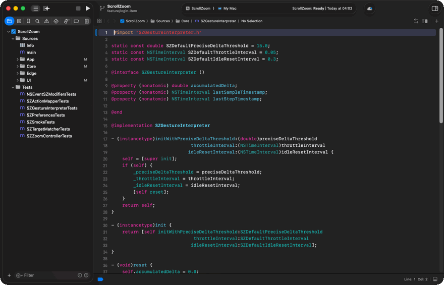
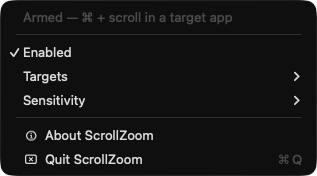
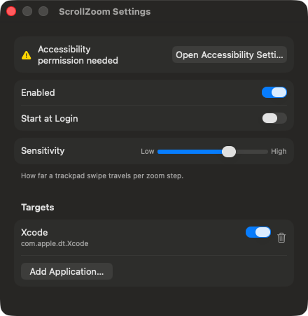

# Xcode - Mouse Wheel Zoom

VS Code–style ⌘ + mouse wheel zoom for Xcode on macOS, with an on-screen zoom indicator.




A HUD shows how far you have zoomed. Ctrl-Opt-Cmd-Z pauses and resumes the agent.

## Requirements

- macOS 14+
- Accessibility permission (you get asked on first run)

## Run

```
xcodegen generate
open ScrollZoom.xcodeproj   # build and run with Cmd-R
```

## Install
```
xcodegen generate
xcodebuild -scheme ScrollZoom -configuration Release -derivedDataPath build build
cp -R build/Build/Products/Release/ScrollZoom.app /Applications/
open /Applications/ScrollZoom.app
```

Turn on **Start at Login** and it comes back after every reboot.



## Settings

Open **Settings...** from the menu bar.



- **Enabled** - enable/disable the app
- **Start at Login** - registers the app as a login item.
- **Sensitivity** - adjust trackpad scrolling (mouse wheels always zoom one step)

## Targets

Works with any app that uses ⌘= / ⌘- for zoom, not just Xcode. Add apps from Settings → Add Application…, or via:
```
defaults write com.erykszczesniak.ScrollZoom SZTargets -array-add \
  '{ bundleIdentifier = "com.example.editor"; }'
```


## How it works

Listens for ⌘ + scroll, converts it to ⌘= / ⌘-, and sends the shortcut only to the frontmost supported app. No code injection, SIP changes, plugins, or third-party dependencies.

Full breakdown: [docs/ARCHITECTURE.md](docs/ARCHITECTURE.md)
